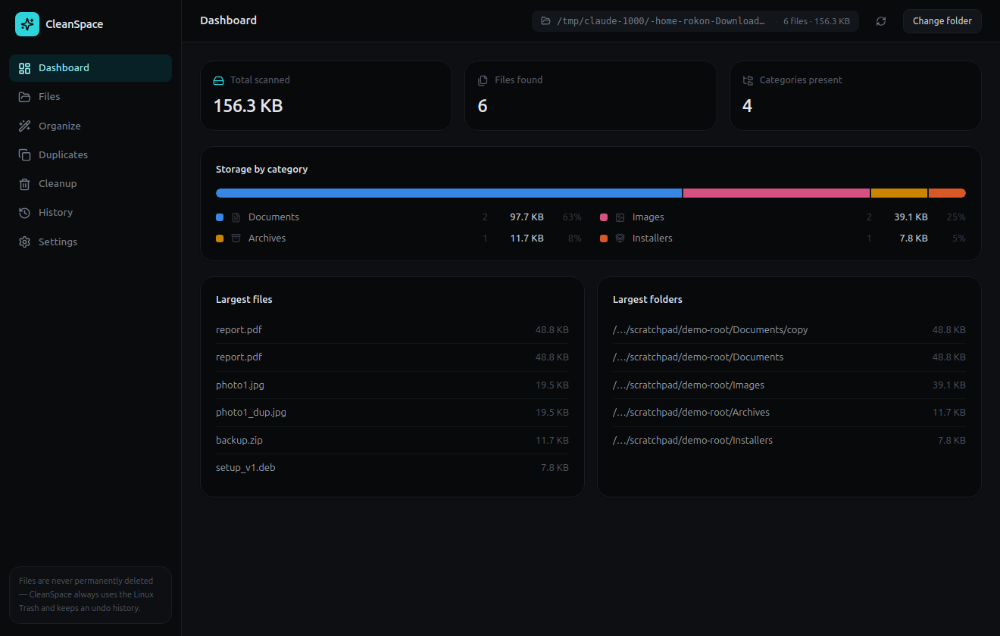
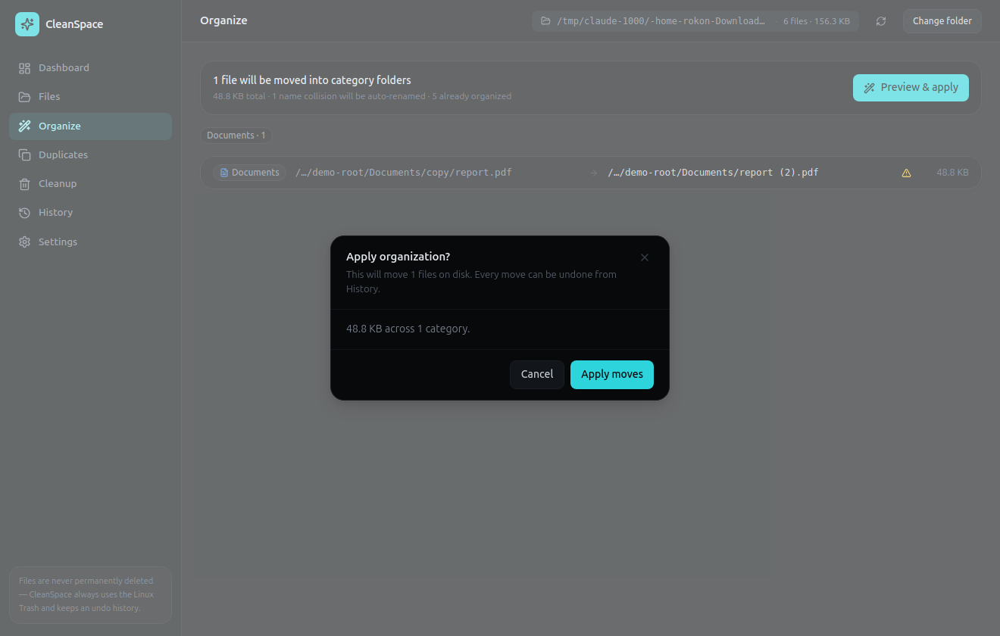
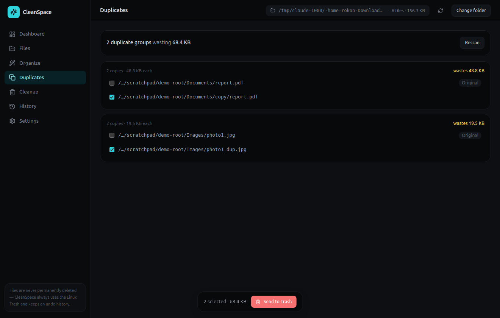
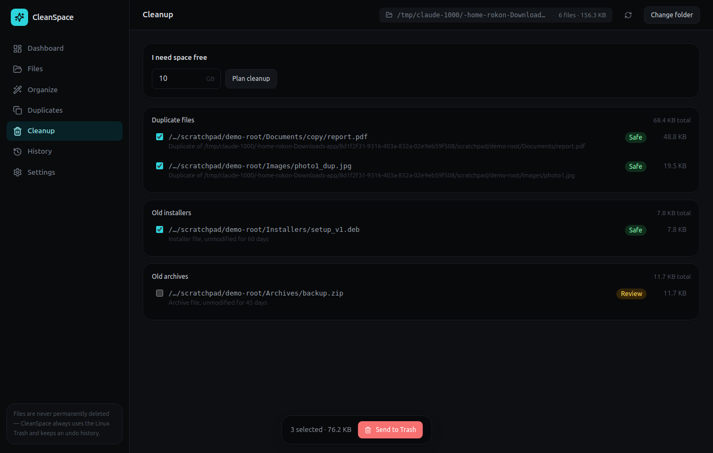

# CleanSpace

A local-first Linux desktop app that helps you understand, organize, and safely clean files on your
computer — scan a folder, see where your space is going, find duplicates, and clean up with a plan.
Nothing is uploaded, nothing is permanently deleted by default, and every change can be previewed and
undone.



## Why

Disk-cleanup tools tend to ask you to trust a black box. CleanSpace instead:

- **shows its work** — every organize action is a preview you approve before anything moves
- **never deletes** — "cleaning up" always means the Linux Trash, never `rm`
- **explains itself** — every cleanup suggestion has a reason and a risk level (safe / review /
  important), and nothing risky is ever pre-selected
- **can be undone** — every file move is reversible from History

## Features

- **Scan** any folder (recursively, safely — protected system paths like `/etc`, `/proc`, `/sys` are
  hard-blocked) and see live progress
- **Dashboard** — total size, file count, and a storage-by-category breakdown
- **Files** — sortable, filterable, searchable browser over everything scanned
- **Organize** — preview a plan to sort files into per-category folders, with collisions safely
  auto-renamed (never silently overwritten), then apply it — or undo it later
- **Duplicates** — found by size → partial hash → full hash, never guessed from size alone
- **Cleanup** — old installers, old archives, and confirmed duplicates surfaced with a reason and a
  risk level, plus an "I need 10 GB free" planner that prefers the safest files first
- **Trash, not delete** — anything you remove goes through the real Linux (freedesktop.org) Trash
- **History & Undo** — every move is logged and reversible
- **Folder monitoring** — get notified when new files land in a folder you're watching (e.g.
  Downloads)
- **Light / dark / system** theming

<table>
<tr>
<td></td>
<td></td>
</tr>
<tr>
<td colspan="2"></td>
</tr>
</table>

## Status

Core functionality (scanning, categorization, analytics, organize with preview/apply/undo, duplicate
detection, cleanup planning, Trash integration, folder monitoring, history) is implemented and has
been manually verified end-to-end against real files — see [`context.md`](context.md) for the full,
honest breakdown of what's been verified versus what hasn't (packaging, a formal performance
benchmark, and a committed automated E2E suite are the main gaps).

This project is developed with a persistent engineering context file — [`context.md`](context.md) —
that documents architecture decisions, safety rules, test status, and a running development log. Read
it before making changes.

## Tech stack

TypeScript (strict) · Electron 33 · React 18 · Vite 5 (via `electron-vite`) · SQLite (`better-sqlite3`)
· Tailwind CSS · Zustand · Zod

## Getting started

Requires Node.js 20+ and a Linux desktop with build tools (`python3`, `make`, `g++` — needed to
rebuild the native SQLite binding against Electron).

```bash
npm install       # also rebuilds better-sqlite3 for Electron (postinstall)
npm run dev        # start in development mode
```

Other commands:

```bash
npm run build          # production build (main + preload + renderer)
npm test                # unit + integration tests (vitest)
npm run lint             # eslint
npm run typecheck        # tsc --noEmit, strict, both processes
npm run format            # prettier --write
npm run dist:deb          # build a .deb (configured; not yet verified)
npm run dist:appimage     # build an AppImage (configured; not yet verified)
```

## Safety model

CleanSpace treats filesystem safety as the top priority — see `context.md` §§10–13 for the full
detail. In short:

- the renderer has no direct filesystem or Node access (`contextIsolation`, no `nodeIntegration`,
  sandboxed preload); every action goes through a narrow, typed, Zod-validated IPC surface
- every path is checked against a hard-coded protected-roots list before it's scanned, watched, or
  moved
- every move is validated immediately before it happens (source exists, destination doesn't already
  exist, neither is a protected path) and recorded, so it can be undone
- "removing" a file always means the Trash, never permanent deletion

## Project structure

```
src/
  main/        — Electron main process: scanner, classifier, duplicate engine, organizer,
                 cleanup planner, Trash integration, folder monitor, database, IPC handlers
  preload/     — the entire renderer-facing API surface (window.cleanSpace.*)
  renderer/    — React UI (Dashboard, Files, Organize, Duplicates, Cleanup, History, Settings)
  shared/      — types, Zod schemas, and constants shared between main and renderer
test/
  unit/        — path safety, classification, cleanup planning, organize-preview collisions,
                 duplicate hashing
  integration/ — scanner against real temporary directory trees
```

See `context.md` §9 for the full annotated structure and §29 for why key architecture decisions were
made the way they were.

## License

Not yet decided (currently marked private/unlicensed in `package.json`).
